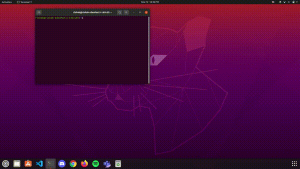

# Greenhouse Navigation Robot (ROS + LiDAR Simulation)

This ROS-based project simulates an autonomous robot navigating a greenhouse environment using LiDAR and odometry data. The robot uses a wall-following strategy to traverse crop rows and switches lanes at the end of each row, allowing it to cover the entire greenhouse without manual intervention.

---

## Demo

The demo shows the traversal of the robot in the greenhouse simulation.

---

## Features

- LiDAR-Based Wall Following: Uses laser scan data to detect proximity to greenhouse walls and rows.
- Dynamic Path Adjustment: Adjusts its heading using pose and laser-derived error calculations to maintain lane alignment.
- Row Detection & Switching: Detects ends of rows and initiates turning and horizontal traversal to switch to the next row.
- Pose Estimation & Orientation Handling: Corrects for yaw discontinuities and uses odometry for orientation control.

---

## Components

- Main Node: Single Python script with complete control logic.
- Sensors Used: Simulated LiDAR (`/ebot/laser/scan`) and odometry (`/odom`).
- Control Output: Velocity commands published to `/cmd_vel`.

---

## Author

Rishab Agrawal

---

## License

This project is licensed under the MIT License. See [LICENSE](LICENSE) for more details.
